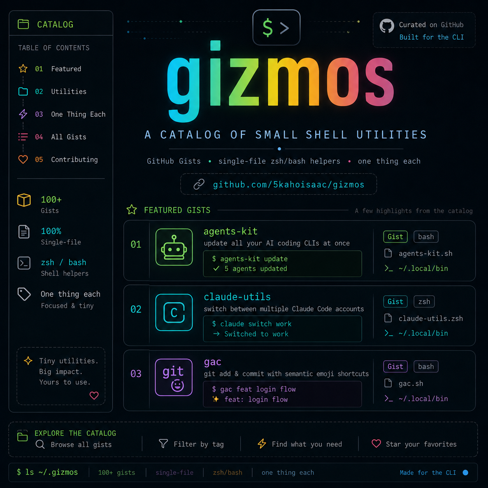

# gizmos



A catalog of small, single-file shell utilities. Nothing here is a framework or
a product — just zsh/bash functions that save a few keystrokes and print pretty
output while doing it. Each one does exactly one thing.

## Table of contents

<!-- toc:start -->
- [Setup](#setup)
- [agents-kit](#agents-kit) — update all your AI coding CLIs at once
- [claude-utils](#claude-utils) — switch between multiple Claude Code accounts
- [gac](#gac) — git add & commit with semantic emoji shortcuts
- [killport](#killport) — kill processes and containers listening on TCP ports
- [License](#license)
<!-- toc:end -->

---

## Setup

Clone the repo, then add this loop to your shell config to source every script.

```sh
# 1. clone the repo
git clone <repo-url> ~/.gizmos

# 2. add to ~/.zshrc
for f in ~/.gizmos/*.sh; do
  [ -r "$f" ] && source "$f"
done

# 3. reload
source ~/.zshrc
```

---

<!-- sections:start -->

## agents-kit

`agents-kit.sh` · bash/zsh

Update all your AI coding command-line tools in one shot — Claude Code,
OpenCode, OpenAI Codex CLI, Pi Coding Agent, LazyCodex — with consistent colored
status for each step. Tools you don't have installed are skipped with a notice.

```sh
agents-kit update            # update everything
agents-kit update --skip-ecc # tools only, skip the ECC repo step
agents-kit --help
```

To also reset and reinstall your local ECC checkout, set its path before
sourcing the script (e.g. in `~/.zshrc`):

```sh
DEFAULT_ECC_REPO="$HOME/src/everything-claude-code"
```

Without `DEFAULT_ECC_REPO` (or `ECC_REPO` / `--ecc-repo PATH`), the ECC update
step is skipped with a warning.

---

## claude-utils

`claude-utils.sh` · zsh

Run more than one Claude Code account on the same machine (e.g. Pro and Max, or
work and personal) and switch between them without logging out and back in.
Project history, MCP servers, plugins, skills, and agents stay shared.

```sh
claude-utils save pro        # capture the current login as "pro"
claude-utils list            # show profiles, active one marked
claude-utils switch pro      # swap to the "pro" account
claude-utils status          # active account + resolved paths
```

Requires [`jq`](https://stedolan.github.io/jq/).

---

## gac

`gac.sh` · zsh

Stage everything and commit with a semantic emoji prefix, in one short command.
Run `gac -h` for the full grouped legend.

```sh
gac f add login endpoint     # → ✅ FEAT: add login endpoint
gac b fix null deref         # → 🐛 BUG FIX: fix null deref
gac -s d update readme       # → 📖 DOCS: update readme   (staged only)
gac just a quick note        # → just a quick note        (no prefix)
```

---

## killport

`killport.sh` · zsh

Kill whatever is listening on a TCP port — the owning process by default, or
the Docker container publishing it in `auto` mode. Supports multiple ports,
signal control, dry-run preview, and a `--no-fail` exit-code override.

```sh
killport 8080               # free port 8080 (SIGTERM the listener)
killport 3000 8080 9090     # free several ports at once
killport -s KILL 8080       # use SIGKILL instead of SIGTERM
killport --dry-run 5432     # preview without killing anything
```

<!-- sections:end -->

## License

[MIT](LICENSE.md)
